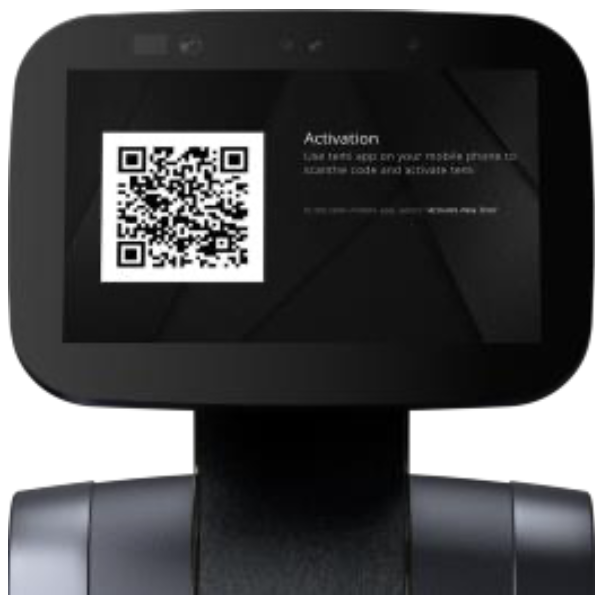
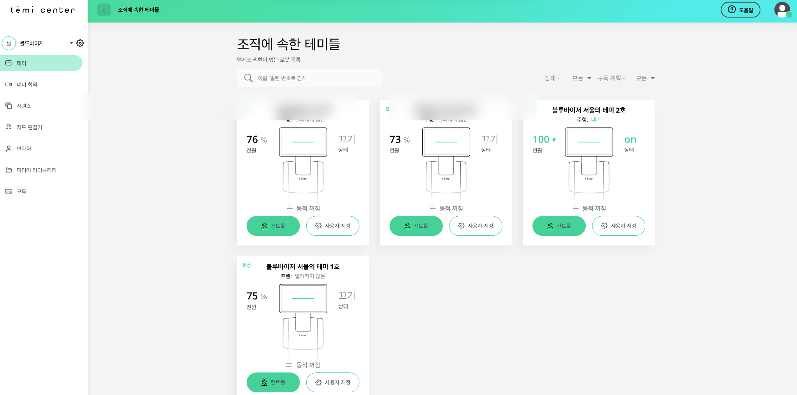

# 🌟 로봇 활성화 방법 🌟
하이버프 로봇 테미를 활성화하는 방법을 안내합니다.

1. 모바일 앱 회원가입
2. 테미 로봇 활성화
3. 테미 센터 확인

---

### 1. 모바일 앱 회원가입
- [애플 앱 스토어](https://apps.apple.com/kr/app/temi/id1332976710)
- [구글 플레이 스토어](https://play.google.com/store/apps/details?id=com.robotemi&hl=ko)
- 다운 받은 모바일앱에서 회원가입을 합니다.
  - 전화번호로 가입 시 대한민국, +82를 선택합니다.
  - 예시) +82 10 1234 5678

### 2. 테미 로봇 활성화
- 아래 테미 로봇에서 QR 코드가 생성이 되면 휴대폰으로 QR코드를 찍어서 [카카오톡 채널](https://pf.kakao.com/_IbQxkxl/#:~:text=%EC%B1%84%EB%84%90%ED%99%88%EC%9D%84%20%ED%8F%B0%EC%9C%BC%EB%A1%9C%0A%EC%A0%91%EC%86%8D%ED%95%B4%EB%B3%B4%EC%84%B8%EC%9A%94.-,%EC%B1%84%EB%84%90,-%EC%B6%94%EA%B0%80)에 공유합니다.

- 활성화가 되면 별도로 안내 드리겠습니다.

### 3. 테미 센터 (PC) 확인
- [테미센터](https://center.robotemi.com/)에 접속 후 테미 모바일 앱에서 QR 스캔을 이용해서 로그인을 합니다.
  - ⚠️ 테미센터는 중복 로그인을 허용하지 않습니다.
-  테미 센터가 정상적으로 로그인되면 아래와 같은 화면에서 테미를 확인하실 수 있습니다.

<!-- ## Links

* Relative: [Codeblock](/codeblock)
* Absolute: [Demo](https://learn.hasura.io/graphql/react) -->