# 🌟 테미 하드웨어 기능 소개 🌟
테미 기기에서 사용되는 주 기능 메뉴에 대해서 설명합니다.

1. 헤드 상호 작용 버튼
2. 지도 맵핑 기능
3. 네비게이션 기능

---

## 1. 헤드에 상호작용 버튼

- 기능: 테미 로봇 상단 헤드에 위치한 상호작용 버튼을 통해 다양한 기능을 사용할 수 있습니다.
  - **따라가기 모드:** 사용자의 움직임을 감지하고 따라갑니다.
  - **앞 사람 인식:** 설정에 따라 앞에 있는 사람을 자동으로 인식합니다.

- **원형버튼:**
  테미 로봇의 우측 원형의 `+` `-` 버튼을 사용하여 음량을 조절할 수 있습니다.

---

## 2. 우측 원형 버튼 및 화면 메뉴
- **아이콘 설명**
  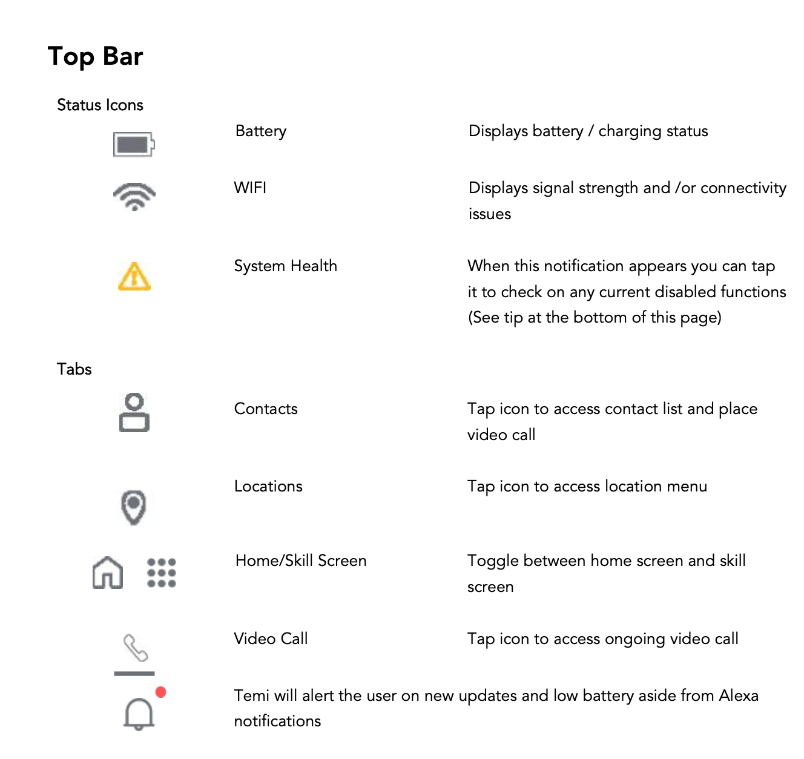

**상단 바 (Top Bar)**
  - 🔋 배터리 /
  배터리 상태 또는 충전 상태를 표시합니다.

  - 📶 WiFi
  신호 강도와 연결 문제를 표시합니다.

  - ⚠️ 시스템 상태 (System Health)
  이 알림이 나타날 경우, 탭하여 현재 비활성화된 기능을 확인할 수 있습니다.
  (페이지 하단의 팁을 참고하세요.)

- **탭 (Tabs)**
  - 👤 연락처 (Contacts)
  아이콘을 탭하면 연락처 목록에 접근하고 화상 통화를 할 수 있습니다.

  - 📍 위치 (Locations)
  아이콘을 탭하면 위치 메뉴에 접근할 수 있습니다.

  - 🏠 홈/스킬 화면 (Home/Skill Screen)
  홈 화면과 스킬 화면 간 전환이 가능합니다.

  - 📞 화상 통화 (Video Call)
  아이콘을 탭하면 진행 중인 화상 통화에 접근할 수 있습니다.

  - 🔔 알림 (Notifications)
  테미가 새 업데이트와 배터리 부족 알림(알렉사 알림 제외)을 사용자에게 전달합니다.
  
- **화면 터치**
  - 화면을 터치한 후, 우측 상단 메뉴 버튼 중 상단 오른쪽 바둑판 버튼을 눌러 메뉴에 진입할 수 있습니다.
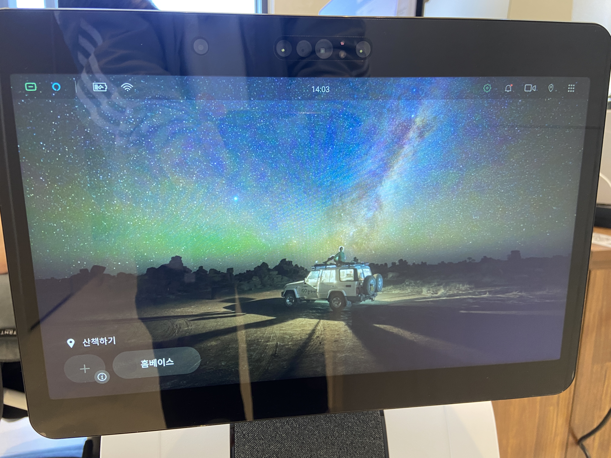
  - 여러 번 스와이프를 통해 테미 설정 메뉴로 빠르게 접근 가능합니다.

---

## 3. 지도 매핑 및 네비게이션 기능
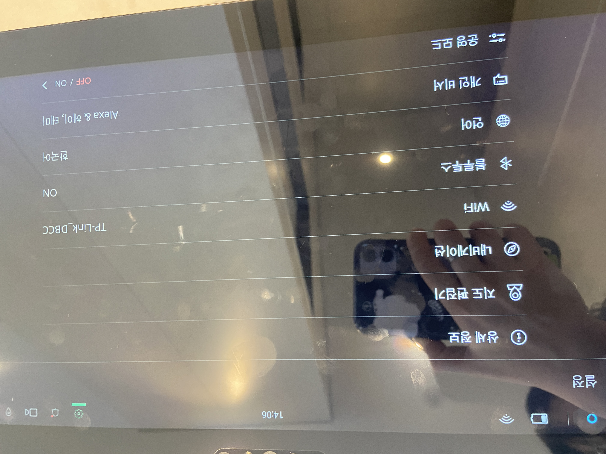

설정 목록에는 있는 지도편집기, 네비게이션 항목에 대해서 설명합니다.

- **지도편집기**
  - **매핑:** 테미의 지도 생성 및 네비게이션을 관리하는 주요 기능입니다. 매핑을 통해 로봇이 환경을 인식하고 경로를 설정합니다.
    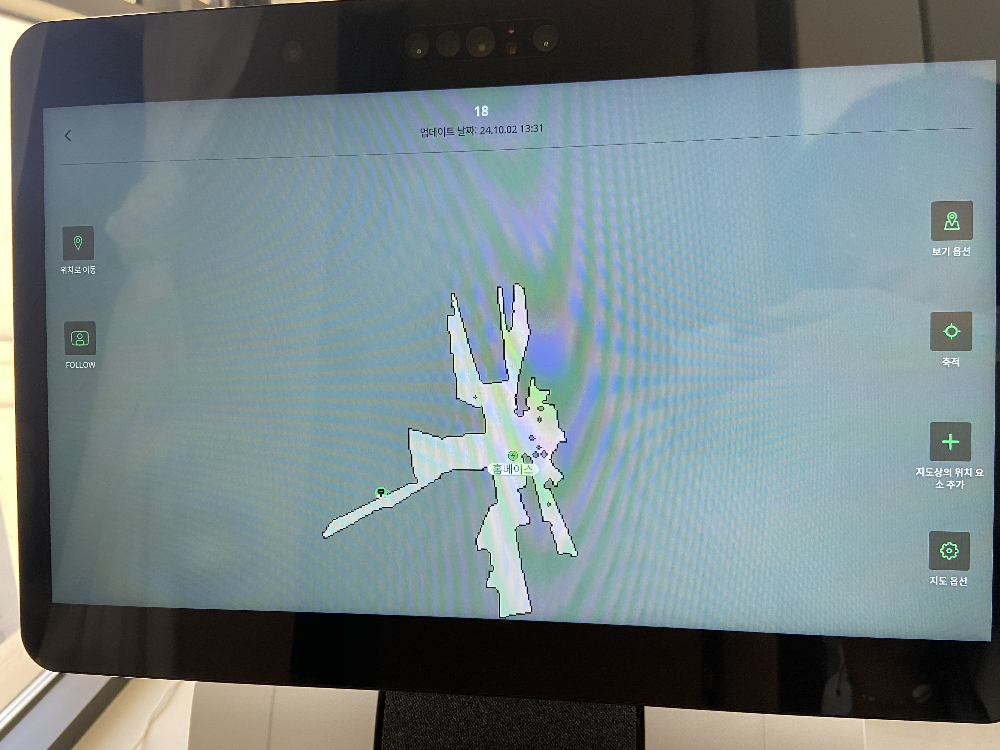
  - 위 사진에서 좌측 상단 아이콘부터 설명합니다.

- **위치로 이동 버튼:** 버튼 클릭 후 맵에서 사용자가 터치한 위치로 이동합니다. 미리 저장된 위치 버튼 클릭 시, 해당 위치로 즉시 이동합니다.
    

- **FOLLOW 모드:** 따라가기 기능을 활성화합니다.
- **보기 옵션:** 맵 요소를 `숨김`/`표시`로 설정 할 수 있습니다. (사진 참고)
    
- **축적:** 실질적으로 사용하지 않는 기능이며, 사용 시 테미 공식 메뉴얼을 참고 바랍니다.

- **지도상의 위치 요소 추가**
    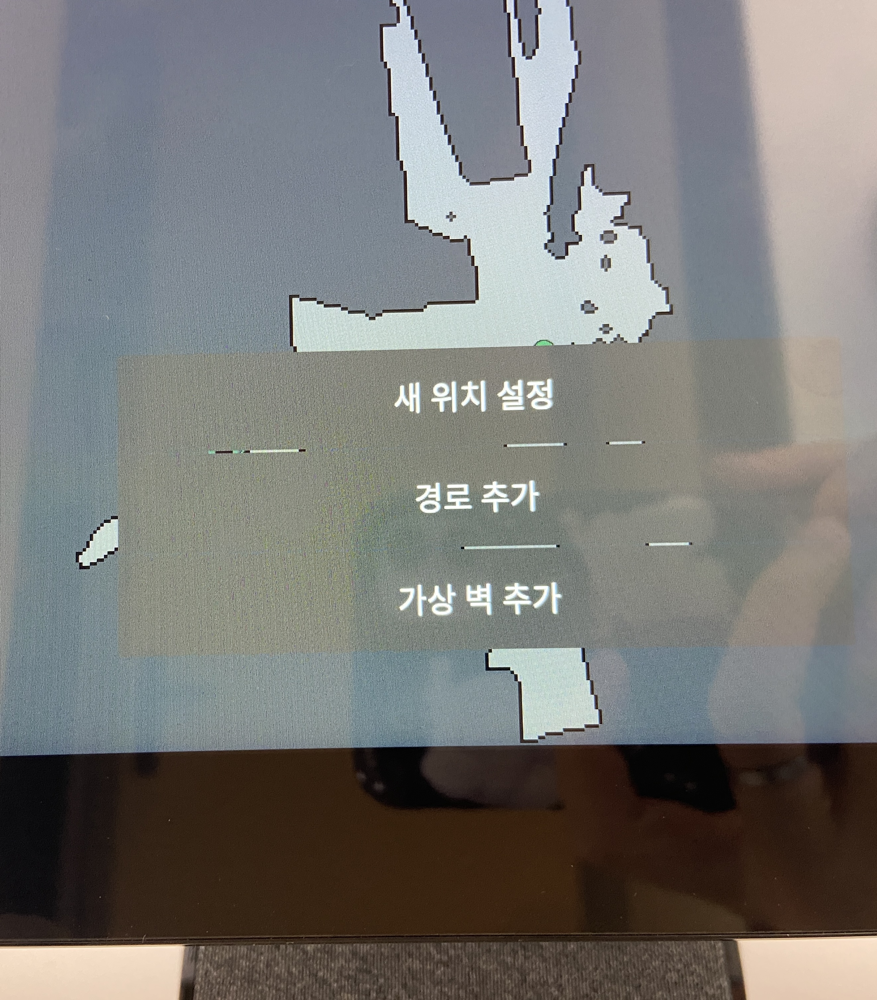
    - **새 위치 설정:** 현재 테미가 서 있는 위치를 기준으로 새로운 장소(예: 주방, 화장실)를 생성할 수 있습니다.
    - **경로 추가:** 
      - 테미의 기본 동작은 자율 주행이지만, 경로를 설정하면 지정된 경로를 따라 이동합니다.
        
      - 경로는 **초록색 선**으로 표시되며, 드래그하여 수정 가능합니다.
    - **가상벽 추가:**
      - 가상벽은 테미의 이동 경로를 제한하거나 장애물로 인식할 수 없는 요소(예: 유리 벽)를 미리 매핑 처리합니다.
        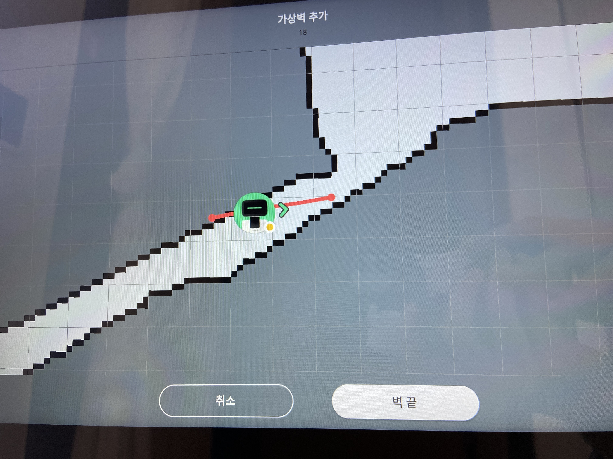
      - 가상벽은 **빨간색 선**으로 표시되며, 드래그하여 위치를 조정할 수 있습니다.
        

- **지도 관련 옵션**  
        [지도 관련 여러 옵션들]
        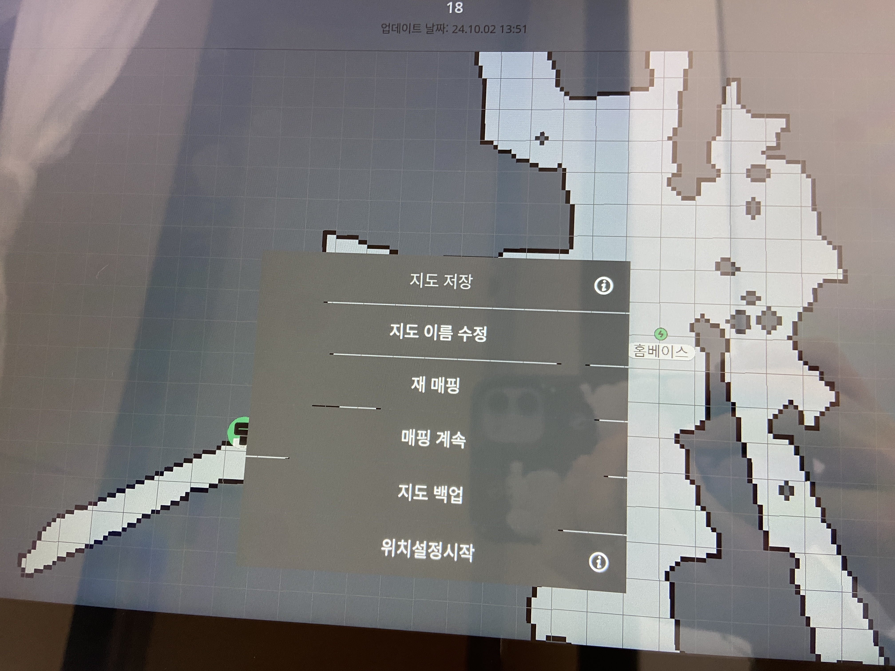

- **지도 저장 및 백업**
  - 테미의 지도를 저장하고, 인터넷 연결 시 테미센터에 백업할 수 있습니다.
  - 나중에 복구하려면 저장된 지도 또는 층을 선택 후 불러오기 버튼을 사용하세요.
    - 지도 백업은 인터넷 연결 시 가능합니다.
    - 테미 센터에서 지도 백업을 불러올 때는 해당 층 or 지도를 눌러서 불러오기를 눌러야 합니다.  
  `층 불러오기는 테미 센터 숨겨진 옵션을 참고하세요.`

- **위치 설정 시작**  
  - 테미가 위치를 다시 인식하도록 설정합니다.
  - 일반적으로 자동으로 설정되지만, 오류 발생 시 수동 설정을 사용합니다.
    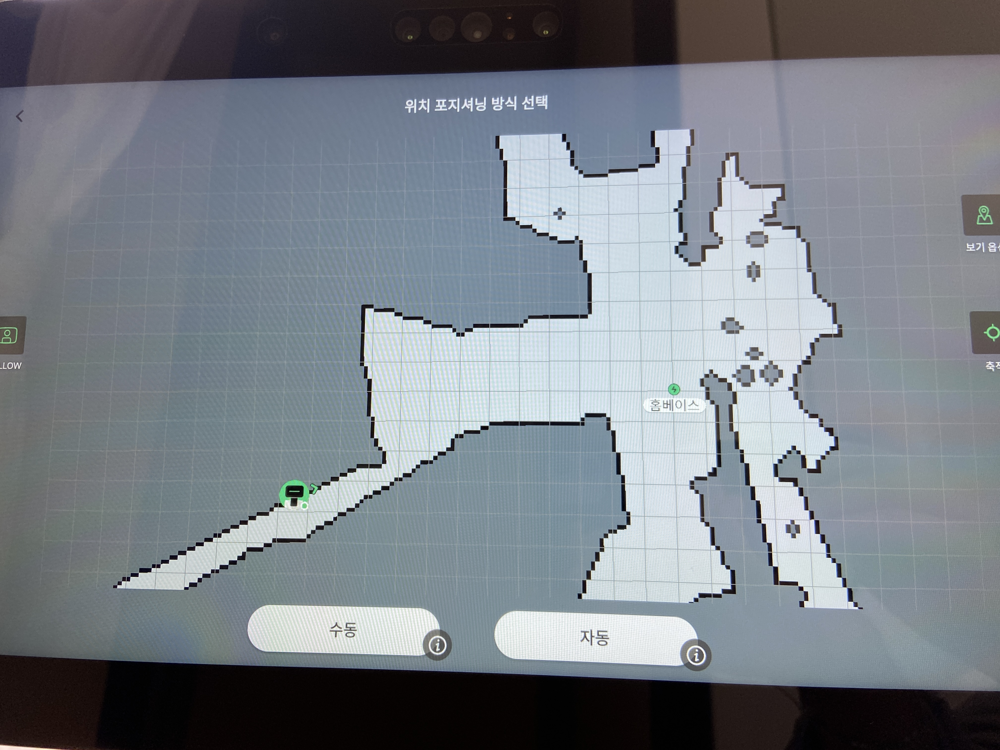

- **수동 설정 사용법:**  
  - 매핑된 지도 위에서 테미의 현재 위치를 적절히 이동시킵니다.
  - 테미 화면이 바라보는 방향을 저장 후 적용합니다.
    
    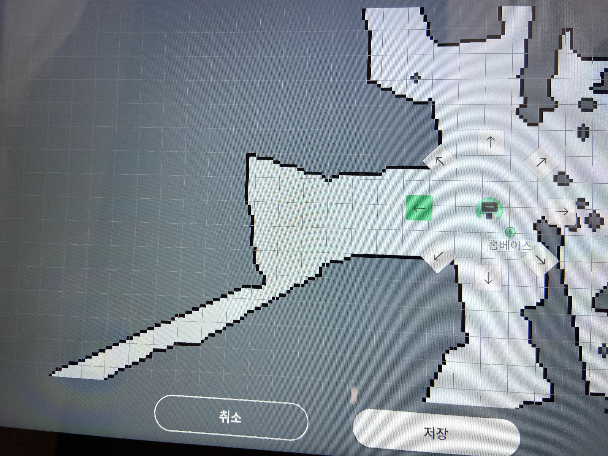

- **네비게이션 설정**
  - **네비게이션 옵션:**
    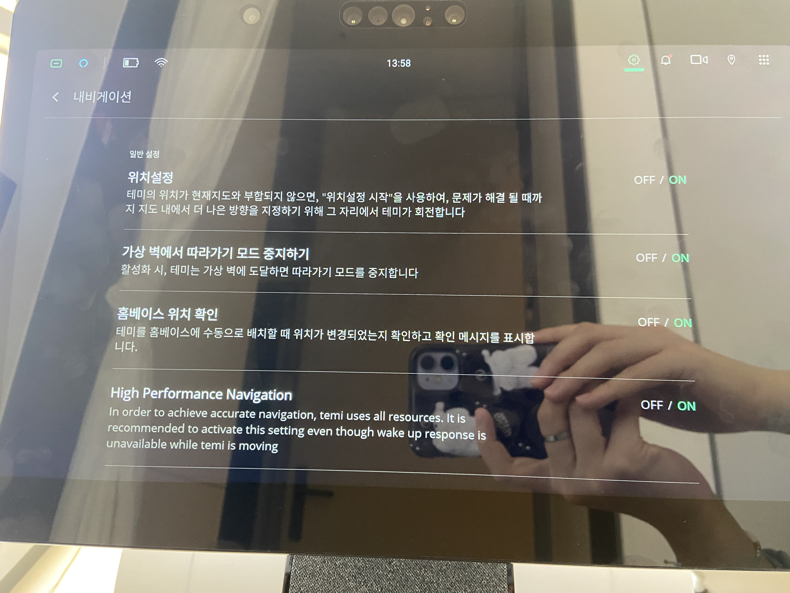
    1. **위치 설정:** 목적지 설정 및 저장.
    2. **가상벽에서 따라가기 중지:** 가상벽 내 따라가기 기능 해제.
    3. **홈베이스 위치 확인:** 테미의 기본 충전 위치.
    4. **High Performance Navigation:** 고성능 네비게이션 설정.

   - **센서 설정:** 
    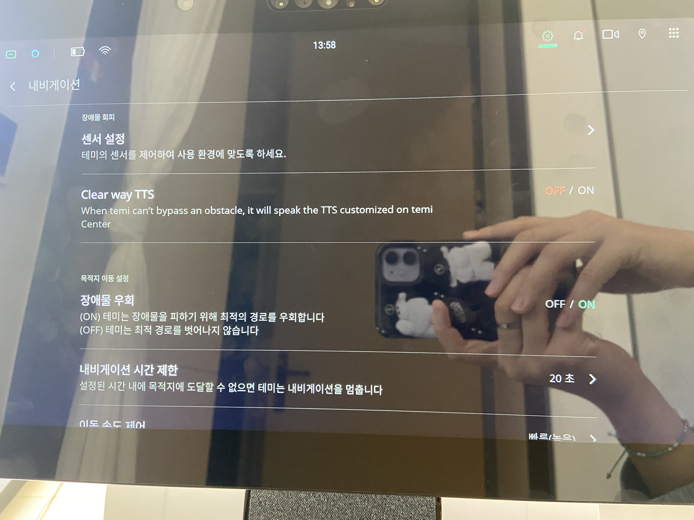
    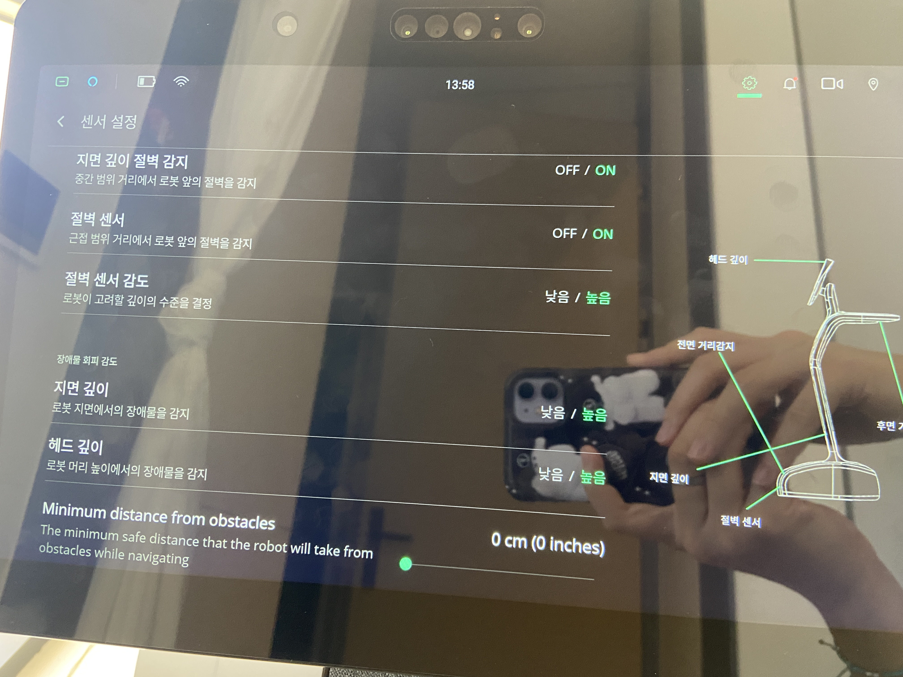
    - 장애물 감지 및 회피
       - **Minimum distance from obstacles (최소 거리 설정):** 장애물과의 최소 거리를 조정합니다. 값이 높을수록 테미가 더 멀리서 장애물을 감지합니다.
       - **장애물 우회:** 경로를 자동으로 조정하여 장애물을 피합니다.
       - **네비게이션 시간 제한:** 설정된 시간 내에 이동이 완료되지 않으면 경로를 재탐색합니다.
- **운영 모드**
    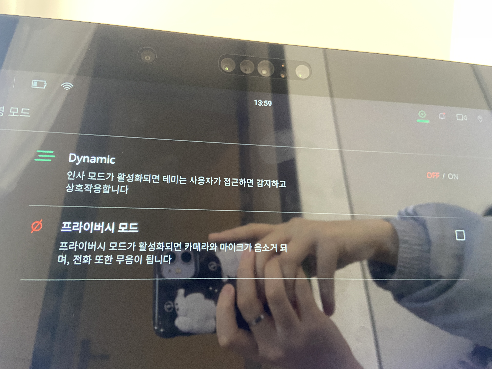
  - **Dynamic 모드 (인사 모드):** 환경 변화에 따른 자율적 움직임.
    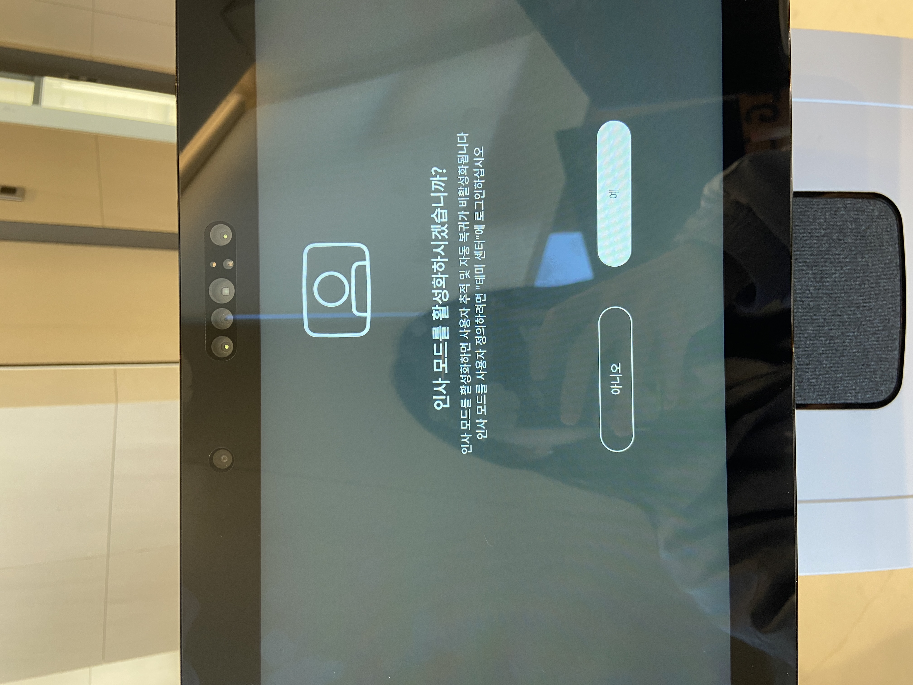
  - **프라이버시 모드:** 특정 상황에서 카메라 및 센서의 기능을 제한.

- **일반 설정**
  - **네비게이션 및 버튼 활성화:**
    버튼을 활성화하거나 비활성화하여 테미의 기능을 조정할 수 있습니다.
  - **인사 모드 변경:**
    테미가 사용자를 맞이하거나 특정 메시지를 전달하는 모드를 설정할 수 있습니다.

    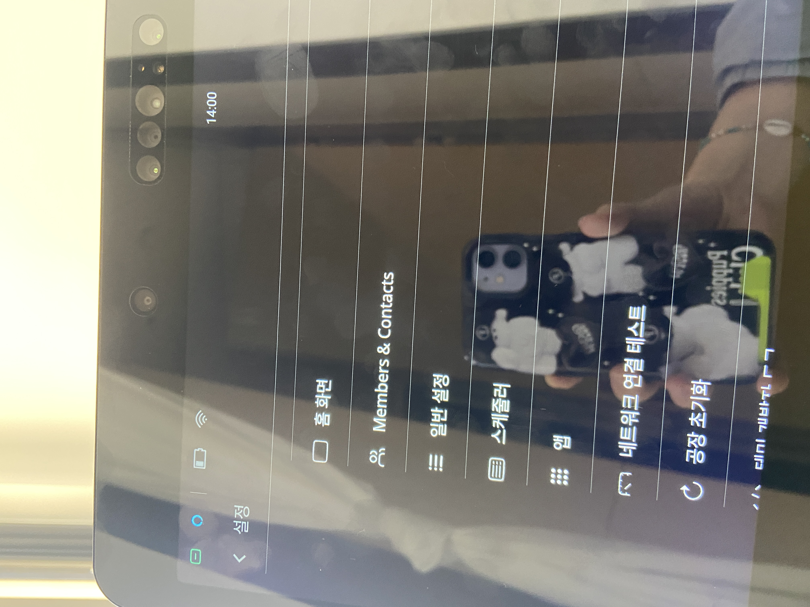  
    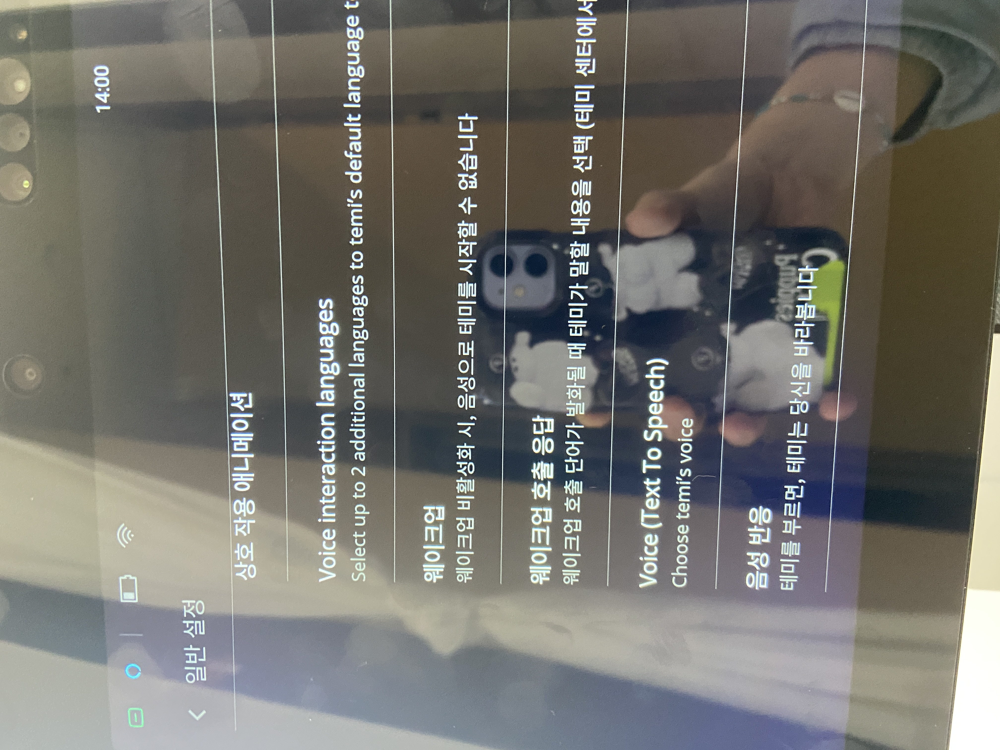  
    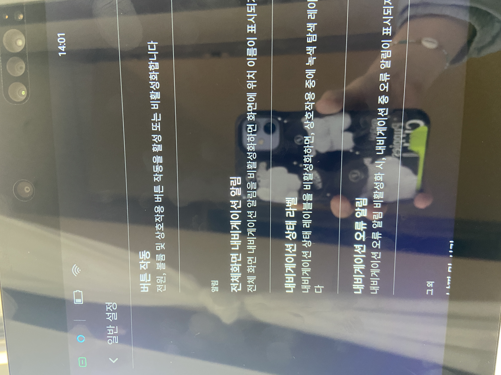  
      
---